# ARCHITECTURE DOCUMENT

# RISC-V Network Telemetry and Secure Packet Monitoring SoC

**Final Year Honours Project --- RTL System-on-Chip Design and
Verification**

**Architecture Baseline:** v2.0\
**Status:** Implementation-oriented architecture baseline\
**Processor:** VeeR EL2 RV32IMC\
**System Bus:** AHB-Lite\
**Primary Verification:** RTL simulation + bare-metal embedded C\
**Primary Project Contribution:** Custom Network Telemetry Engine and
SoC integration

---

# Table of Contents

> Click any section below to jump directly to it.

> **Pagination note:** The document contains explicit page markers and Pandoc-compatible page breaks. Physical page numbers in a rendered PDF depend on the selected renderer, paper size, margins, font, and pagination settings.

- [0. Introduction](#0-introduction)
- [1. Block Diagram](#1-block-diagram)
- [2. Signal List](#2-signal-list)
- [3. All IPs](#3-all-ips)
- [4. Control Path](#4-control-path)
- [5. Data Path](#5-data-path)
- [6. Ethernet Packet Architecture](#6-ethernet-packet-architecture)
- [7. Network Telemetry Engine](#7-network-telemetry-engine)
- [8. 128-bit Telemetry Record](#8-128-bit-telemetry-record)
- [9. Memory Map](#9-memory-map)
- [10. Register Maps](#10-register-maps)
- [11. AHB-Lite Bus Protocol Details](#11-ahb-lite-bus-protocol-details)
- [12. Interrupt Architecture](#12-interrupt-architecture)
- [13. Reset and Clock Architecture](#13-reset-and-clock-architecture)
- [14. Timer and Timestamp Architecture](#14-timer-and-timestamp-architecture)
- [15. AES-128 Architecture](#15-aes-128-architecture)
- [16. UART Architecture](#16-uart-architecture)
- [17. GPIO Architecture](#17-gpio-architecture)
- [18. Software Architecture](#18-software-architecture)
- [19. End-to-End Testbench Architecture](#19-end-to-end-testbench-architecture)
- [20. Verification Architecture](#20-verification-architecture)
- [21. IP Integration and Provenance](#21-ip-integration-and-provenance)
- [22. Scope and Non-Goals](#22-scope-and-non-goals)
- [23. Architectural Constraints](#23-architectural-constraints)
- [24. Implementation Phases and Definition of Done](#24-implementation-phases-and-definition-of-done)
- [25. Design-Critical Register/Interface Freeze List](#25-design-critical-registerinterface-freeze-list)
- [26. Risks and Open Items](#26-risks-and-open-items)
- [27. Architecture-to-RTL Mapping](#27-architecture-to-rtl-mapping)
- [28. Architecture-to-Software Mapping](#28-architecture-to-software-mapping)
- [29. End-to-End Functional Contract](#29-end-to-end-functional-contract)
- [30. Final Architecture Summary](#30-final-architecture-summary)
- [31. Source Basis](#31-source-basis)

---

<div align="right">Page 2</div>

[Back to Table of Contents](#table-of-contents)

# 0. Introduction

The RISC-V Network Telemetry and Secure Packet Monitoring SoC is a
compact embedded System-on-Chip built around the VeeR
EL2 RV32IMC processor. The SoC is intended to demonstrate a coherent
hardware/software co-design in which repetitive packet-processing
operations are implemented in hardware while the RISC-V processor
performs configuration, event handling, telemetry retrieval,
cryptographic job control, and reporting.

The SoC receives simulated Ethernet traffic directly from the
verification environment through an 8-bit streaming interface. No
physical Ethernet PHY, GMII/RGMII interface, external MAC,
board-specific network interface, or network clock-domain crossing is
part of the functional SoC.

For the current implementation, the packet model is Ethernet II with a
received four-byte Ethernet FCS. IPv4 and higher-layer parsing are
reserved for a future extension. The Network Telemetry Engine therefore
establishes the packet-processing architecture and metadata model
without requiring a complete TCP/IP stack.

The hardware data path performs packet parsing, packet/byte/error
accounting, frame-length tracking, and CRC-32/FCS checking concurrently.
At packet completion, the Network Telemetry Engine captures a telemetry
snapshot and raises its external interrupt. The VeeR PIC receives the
independent Network, AES, and Timer interrupt sources. Software services
the network event, reads the telemetry registers, reads the CRC
result/status, reads the custom Timer to obtain the **CPU-observed
packet-event timestamp**, constructs the 128-bit telemetry record,
submits it to the AES-128 accelerator, services the AES completion
interrupt, and transmits the protected result through the custom UART.

The design is intentionally structured as one application flow rather
than a processor connected to unrelated demonstration peripherals.

## 0.1 Design Authority and Freeze Rule

This document is the implementation-oriented architecture specification
for RTL, embedded software, integration, and verification.

The following rules apply:

1. Statements marked **ARCHITECTURE REQUIREMENT** are design
 requirements.
2. Signal widths, register offsets, interrupt assignments, reset
 behavior, packet timing rules, and data/control-path ownership are
 implementation-defining.
3. VeeR-specific facts are derived from the supplied VeeR EL2 source
 and Programmer's Reference Manual.
4. Existing project documents are retained as the baseline where they
 do not conflict with confirmed VeeR behavior or the decisions
 recorded in this document.
5. Where an exact VeeR build parameter is not exposed by the supplied
 source/configuration evidence, the item is explicitly marked
 **RTL-CONFIG DEPENDENT** rather than guessed.
6. No downstream RTL or software interface should silently change a
 frozen item.

The project sources define the architecture around VeeR EL2, AHB-Lite,
IMEM, DMEM, UART, Timer, GPIO, Network Telemetry, AES-128, and CRC32.
The original architecture document explicitly describes itself as the
implementation-oriented specification translating the abstract into RTL,
software, verification, block-diagram, memory-map, interface, and bus
requirements.

---

<div align="right">Page 3</div>

[Back to Table of Contents](#table-of-contents)

# 1. Block Diagram

## 1.1 Top-Level SoC Architecture

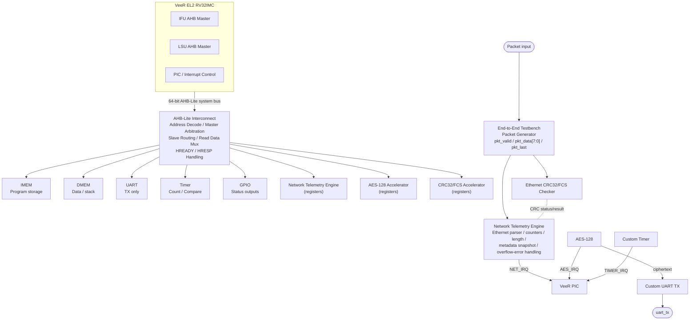

## 1.2 Architectural Separation

The SoC has two logically distinct paths.

### Control Path

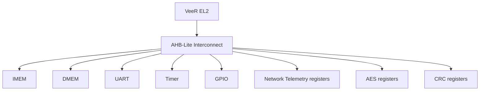

The control path carries configuration, register accesses, status,
software data, and interrupt-related control.

### Data Path

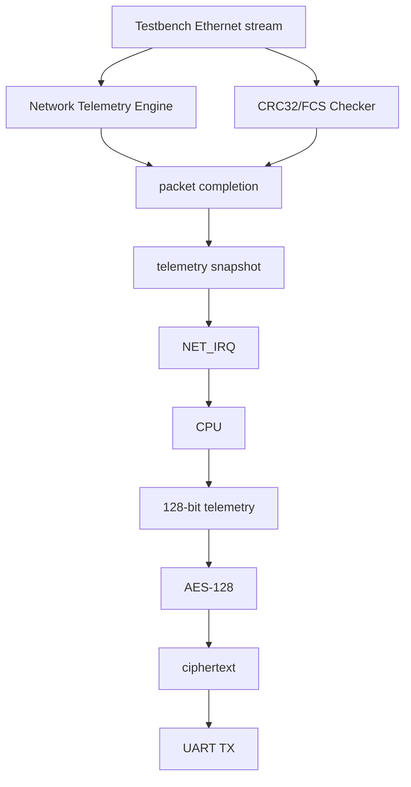

The packet stream is not transported through the AHB-Lite bus. The
AHB-Lite bus exposes the control/status register interfaces of the
packet-processing IP.

---

<div align="right">Page 4</div>

[Back to Table of Contents](#table-of-contents)

# 2. Signal List

## 2.1 SoC Top-Level External Ports

| Signal | Direction | Width | Description |
|---|---|---|---|
| `clk` | Input | 1 | Main synchronous SoC clock |
| `reset_n` | Input | 1 | Active-low functional SoC reset; exact connection to VeeR `rst_l` follows supplied wrapper |
| `pkt_valid` | Input | 1 | Indicates `pkt_data` is a valid byte |
| `pkt_data` | Input | 8 | Incoming Ethernet frame byte |
| `pkt_last` | Input | 1 | Indicates the final valid byte of the current frame |
| `uart_tx` | Output | 1 | Custom UART transmit output |
| `gpio[3:0]` | Output | 4 | Hardware-visible status outputs |

No physical Ethernet interface is exposed.

## 2.2 Packet Streaming Interface

| Signal | Width | Rule |
|---|---|---|
| `pkt_valid` | 1 | A packet byte is transferred only when asserted |
| `pkt_data[7:0]` | 8 | Must be sampled on a clock where `pkt_valid=1` |
| `pkt_last` | 1 | Must assert with the final valid packet byte |

Timing rules:

1. `pkt_data` is meaningful only when `pkt_valid=1`.
2. `pkt_last` is meaningful only with `pkt_valid=1`.
3. A frame begins with the first cycle for which `pkt_valid=1` after
 the interface is idle.
4. A frame ends on a cycle where `pkt_valid=1` and `pkt_last=1`.
5. `pkt_valid` may contain gaps between valid bytes; the parser must
 not advance its byte position during invalid cycles.
6. The testbench must not assert `pkt_last` without `pkt_valid`.
7. A new frame must not begin until the preceding frame has ended.
8. No `pkt_ready` handshake exists in the current interface.
9. The interface is synchronous to the SoC clock.
10. The testbench supplies Ethernet frame bytes directly; preamble and
 SFD are not part of the packet stream.
11. The testbench supplies the four-byte Ethernet FCS as part of the
 frame.
12. Current frame length is constrained to the Ethernet minimum and
 maximum defined by this project: 64 to 1518 bytes including FCS.

## 2.3 VeeR AHB-Lite Interface

The VeeR source and PRM describe 64-bit AHB-Lite data
interfaces.

| Signal | Width | Description |
|---|---|---|
| `HADDR` | 32 | Transfer address |
| `HTRANS` | 2 | IDLE/BUSY/NONSEQ/SEQ |
| `HWRITE` | 1 | Read/write direction |
| `HSIZE` | 3 | Transfer size |
| `HBURST` | 3 | Burst type |
| `HPROT` | 4 | Protection/access attributes |
| `HWDATA` | 64 | Write data |
| `HRDATA` | 64 | Read data |
| `HREADY` | 1 | Transfer completion / wait-state indication |
| `HRESP` | 1 | OKAY/ERROR response |
| `HSEL` | 1 per selected slave | Slave select |

The original project port list used 32-bit `HWDATA`/`HRDATA`; this is
superseded for the VeeR connection by the supplied VeeR AHB interface
evidence showing 64-bit data.

## 2.4 AHB-Lite Peripheral-Side Interface

Each memory-mapped slave wrapper exposes the common bus subset required
by the interconnect:

```text
HCLK
HRESETn
HSEL
HADDR[31:0]
HTRANS[1:0]
HWRITE
HSIZE[2:0]
HBURST[2:0]
HPROT[3:0]
HWDATA[63:0]
HRDATA[63:0]
HREADY
HREADYOUT
HRESP
```

Register accesses used by software are 32-bit word-aligned accesses. The
AHB data width remains 64 bits at the VeeR/interconnect boundary.

## 2.5 Interrupt Signals

| Source ID | Signal | Source | Purpose |
|---|---|---|---|
| 1 | `NET_IRQ` | Network Telemetry Engine | Packet snapshot/event available |
| 2 | `AES_IRQ` | AES-128 | Encryption complete |
| 3 | `TIMER_IRQ` | Custom Timer | Compare/match event |

These three sources are independently connected to the VeeR PIC. They
are not ORed together.

## 2.6 GPIO Outputs

| GPIO | Name | Meaning |
|---|---|---|
| `gpio[0]` | `CPU_ALIVE` | Software-controlled CPU/system alive indication |
| `gpio[1]` | `PKT_RX` | Packet reception/event indication |
| `gpio[2]` | `AES_BUSY` | AES accelerator busy state |
| `gpio[3]` | `PKT_ERR` | Packet/parser error indication |

---

<div align="right">Page 5</div>

[Back to Table of Contents](#table-of-contents)

# 3. All IPs

## 3.1 IP Inventory

| IP | Type | Primary Role | Bus Interface | Dedicated Interface |
|---|---|---|---|---|
| VeeR EL2 | CPU/control plane processor | masters | AHB-Lite | PIC, reset, clock |
| IMEM | Custom memory | Instruction storage | AHB-Lite slave | None |
| DMEM | Custom memory | Data/stack storage | AHB-Lite slave | None |
| AHB-Lite Interconnect | Custom SoC infrastructure | Routing/arbitration | AHB-Lite | None |
| UART | Custom | Console/telemetry output | AHB-Lite slave | `uart_tx` |
| Timer | Custom | Free-running time base/compare | AHB-Lite slave | `TIMER_IRQ` interrupt |
| GPIO | Custom | Hardware status outputs | AHB-Lite slave | `gpio[3:0]` |
| Network Telemetry Engine | Custom | Ethernet parsing/counters/snapshot | AHB-Lite slave | `pkt_valid`, `pkt_data`, `pkt_last`, `NET_IRQ` |
| AES-128 | Adapted open-source IP | Telemetry encryption | AHB-Lite wrapper | `AES_IRQ` |
| CRC32/FCS | Adapted open-source IP | Ethernet FCS integrity checking | AHB-Lite wrapper | packet byte stream |

The architecture identifies Network Telemetry, AES-128, and CRC32 as
the three additional IPs. The Network Telemetry Engine is the principal
project-specific RTL contribution.

---

<div align="right">Page 6</div>

[Back to Table of Contents](#table-of-contents)

# 4. Control Path

## 4.1 Control-Plane Responsibilities

The VeeR CPU is responsible for:

1. Boot and system initialization.
2. UART initialization.
3. Timer configuration.
4. GPIO configuration.
5. Network Telemetry Engine enable/configuration.
6. CRC status/control handling.
7. AES key and plaintext loading.
8. Interrupt enable/configuration.
9. Packet-event interrupt servicing.
10. Reading telemetry snapshots.
11. Reading CRC/FCS status.
12. Reading the Timer timestamp source.
13. Constructing the 128-bit telemetry record.
14. Starting AES-128.
15. Servicing AES completion.
16. Reading ciphertext.
17. Reporting results through UART.

Hardware is responsible for:

1. Packet-byte reception.
2. Ethernet field parsing.
3. Packet and byte counting.
4. Error detection.
5. Frame-length tracking.
6. CRC/FCS checking.
7. Telemetry snapshot generation.
8. Interrupt assertion.
9. AES cryptographic transformation after software submission.
10. Timer counting and compare generation.
11. GPIO hardware status indication.

## 4.2 Control Sequence

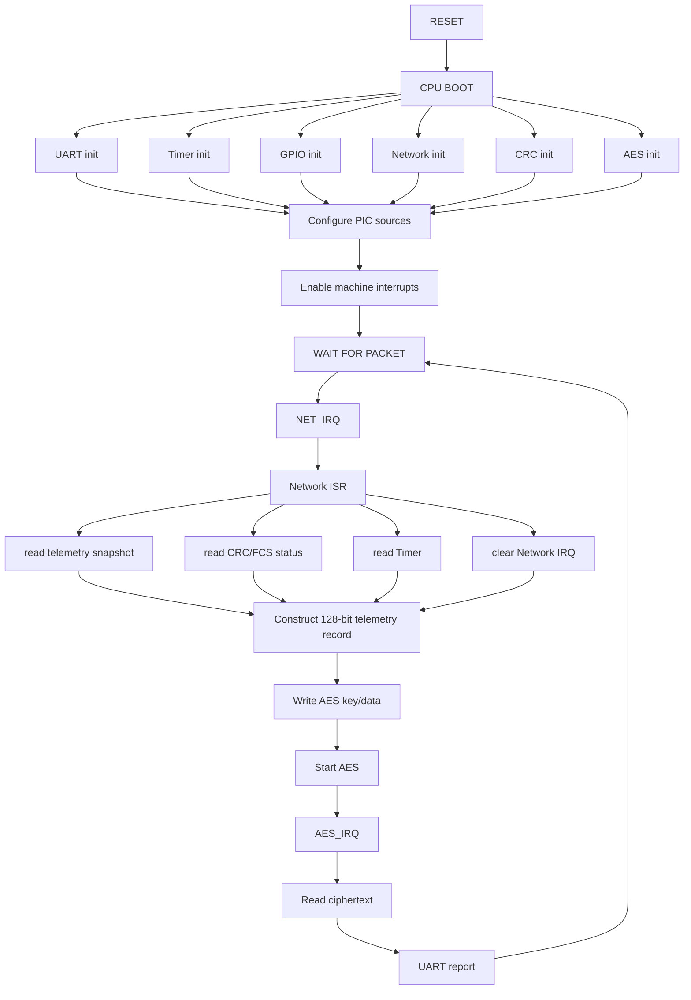

---

<div align="right">Page 7</div>

[Back to Table of Contents](#table-of-contents)

# 5. Data Path

## 5.1 Ethernet Ingress

The testbench generates a complete Ethernet II frame:

| Destination MAC | Source MAC | EtherType | Payload | FCS |
|---|---|---|---|---|
| 6 bytes | 6 bytes | 2 bytes | 46..1500 bytes* | 4 bytes |

`*` Project frame-size limits are defined by the complete frame length
of 64--1518 bytes.

The current implementation does not include Ethernet preamble/SFD.

## 5.2 Concurrent Parser and CRC Path

The packet stream is fanned out logically:

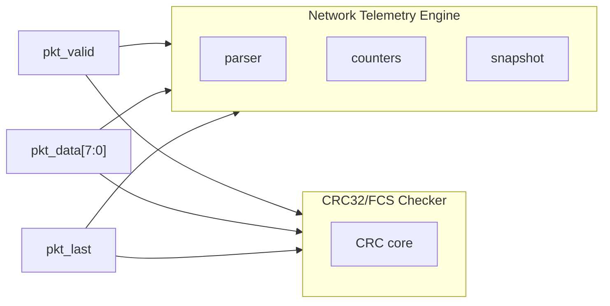

CRC is not placed in series with the parser.

The CRC engine observes the same packet bytes so that:

- parser timing is not dependent on CRC latency;
- CRC cannot alter the packet stream seen by the parser;
- parser and CRC can be verified independently;
- the packet completion event provides a common transaction boundary.

## 5.3 CRC/FCS Semantics

The CRC engine processes the Ethernet frame content excluding the
received four-byte FCS.

At the end of the frame:

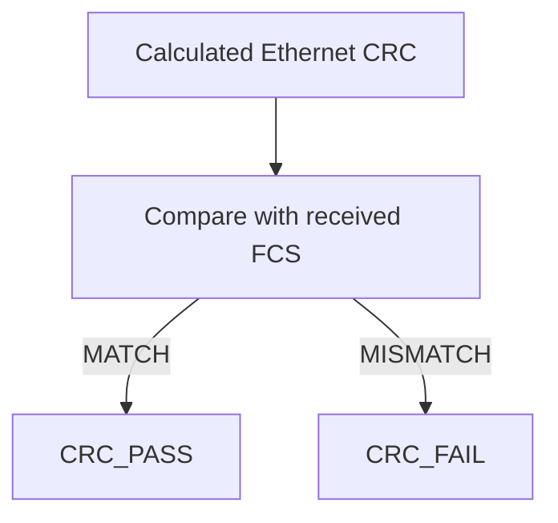

The four-byte FCS is included in `pkt_data` but is excluded from the CRC
calculation input.

CRC failure is an integrity result and is distinct from a structural
parser error.

## 5.4 CPU-to-AES Path

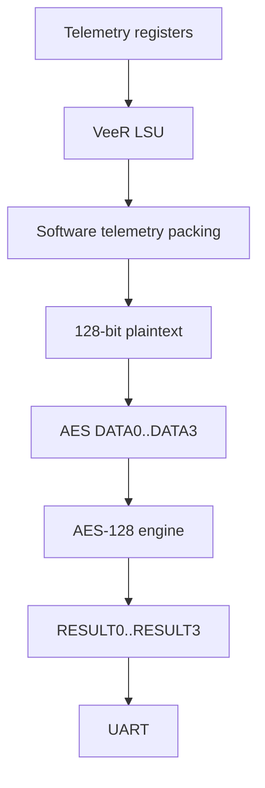

The AES core is not directly connected to the packet byte stream.

---

<div align="right">Page 8</div>

[Back to Table of Contents](#table-of-contents)

# 6. Ethernet Packet Architecture

## 6.1 Current Scope

The current parser supports the project-defined Ethernet II frame model.

Supported at the architectural level:

- Destination MAC extraction.
- Source MAC extraction.
- EtherType extraction.
- Frame-length measurement.
- FCS reception/checking.
- Packet/error counters.
- Telemetry snapshot generation.

IPv4 parsing is a future extension.

The architecture deliberately reserves the IP-oriented telemetry fields
so that IPv4 parsing can be introduced without redesigning the complete
CPU/AES/UART flow.

## 6.2 EtherType Handling

Current behavior:

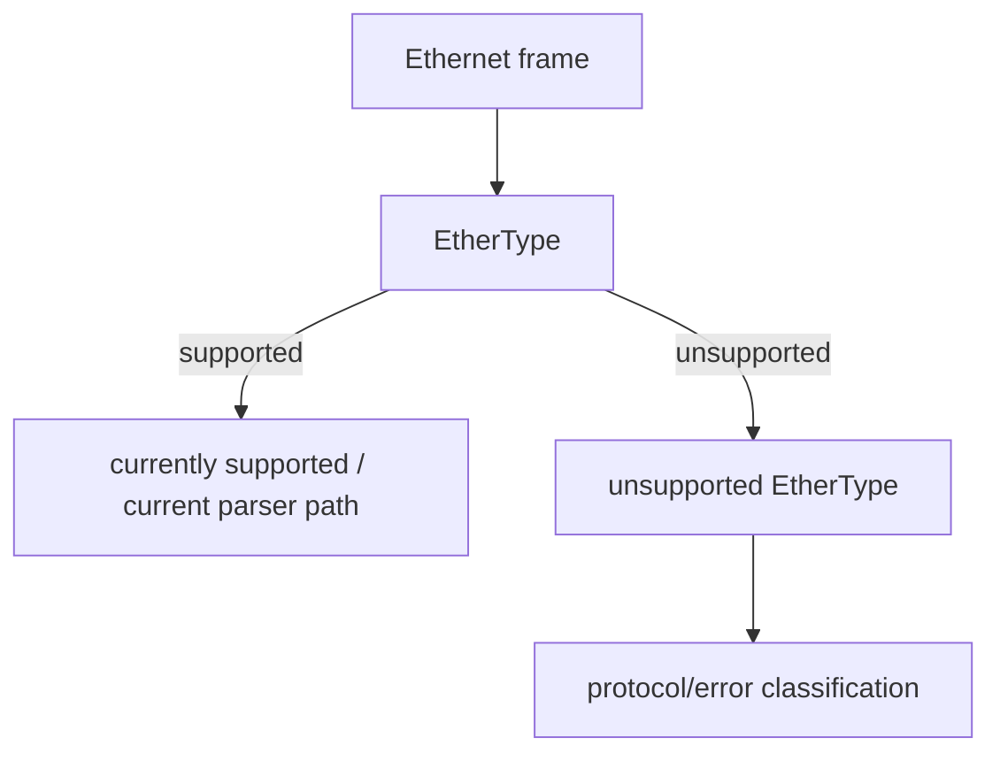

An unsupported EtherType is not automatically classified as an Ethernet
CRC failure. CRC/FCS status remains independently meaningful.

## 6.3 Frame Timing Rules

The parser advances its byte index only on:

```text
pkt_valid == 1
```

The final byte is:

```text
pkt_valid == 1
pkt_last == 1
```

Invalid cycles do not increment frame length or parser position.

A malformed `pkt_last` condition or invalid frame sequencing is treated
as a structural packet error.

---

<div align="right">Page 9</div>

[Back to Table of Contents](#table-of-contents)

# 7. Network Telemetry Engine

**Base address:** `0x1000_3000`

## 7.1 Responsibilities

The Network Telemetry Engine:

- receives the 8-bit packet stream;
- parses Ethernet fields;
- reserves architecture space for future IPv4/UDP parsing;
- counts packets;
- counts bytes;
- counts packet/parser errors;
- tracks the latest frame length;
- stores the latest telemetry fields;
- handles a one-entry telemetry snapshot;
- reports overflow if a new packet arrives while the snapshot is
 occupied;
- raises `NET_IRQ` when a completed packet produces a valid snapshot;
- exposes software-visible control/status registers.

## 7.2 Telemetry Engine Internal States

A practical implementation may use the following FSM:

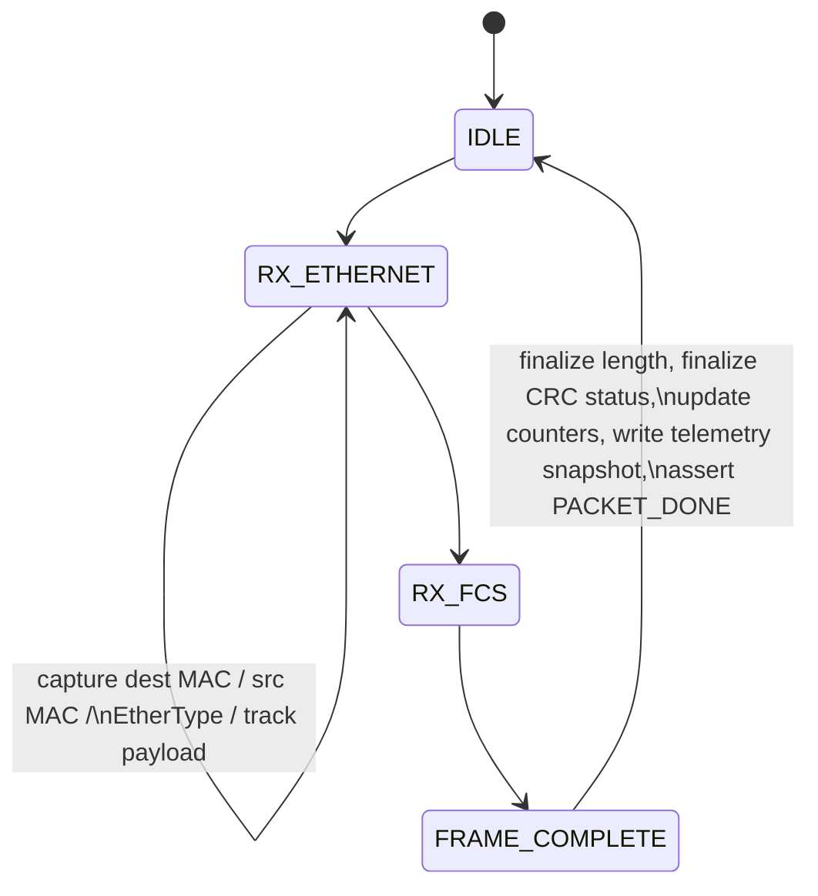

The exact RTL FSM encoding is implementation-defined, but externally
observable behavior must follow this architecture.

## 7.3 Telemetry Snapshot Ownership

The telemetry engine contains one logical snapshot.

On successful packet completion:

1. The packet metadata is committed to the snapshot.
2. `PACKET_READY` becomes asserted.
3. `PACKET_DONE` becomes asserted.
4. `NET_IRQ` is asserted when enabled.
5. Software reads the snapshot.

If another complete packet arrives while the snapshot is occupied:

- the new snapshot is not allowed to silently overwrite the
 software-visible packet;
- an overflow condition is recorded;
- the subsequent packet is dropped from snapshot delivery;
- the overflow condition is visible through status;
- counters continue to reflect the defined packet/error policy.

This one-entry scheme is intentional for the first implementation. It
avoids the complexity of a packet FIFO while making loss visible and
deterministic.

---

<div align="right">Page 10</div>

[Back to Table of Contents](#table-of-contents)

# 8. 128-bit Telemetry Record

The project retains the IP-oriented telemetry record even though the
current parser is Ethernet-first. Fields not available before the IPv4
extension are reserved/zero.

The software constructs four 32-bit words and presents them to AES as
one 128-bit block.

## 8.1 Logical Telemetry Fields

```text
Source IP
Destination IP
Source Port
Destination Port
Protocol
Length
Timestamp
CRC / integrity status
```

For the current Ethernet-only implementation:

```text
Source IP = 0x00000000
Destination IP = 0x00000000
Source Port = 0x0000
Destination Port = 0x0000
Protocol = 0x00 / reserved
Length = Ethernet frame length
Timestamp = CPU-observed packet-event timestamp
CRC status = Ethernet FCS result
```

## 8.2 128-bit Packing

The architecture reserves the 128-bit block as four software-defined
32-bit words:

```text
TELEMETRY[127:96] = WORD0
TELEMETRY[95:64] = WORD1
TELEMETRY[63:32] = WORD2
TELEMETRY[31:0] = WORD3
```

Logical field packing within these words is a software ABI decision and
must remain stable once `network.h` is frozen. The initial
implementation must document the selected bit allocation in the software
header and AES testbench. Reserved bits must be written as zero.

The record is intentionally IP-oriented so that future IPv4/UDP support
can populate the reserved fields without changing the AES block size or
end-to-end application sequence.

---

<div align="right">Page 11</div>

[Back to Table of Contents](#table-of-contents)

# 9. Memory Map

**Baseline map --- must be checked against the final VeeR ICCM/DCCM
configuration before RTL freeze.**

| Start | End | Size | Block | Access |
|---|---|---|---|---|
| `0x0000_0000` | `0x0000_7FFF` | 32 KB | IMEM | IFU read/execute |
| `0x0001_0000` | `0x0001_7FFF` | 32 KB | DMEM | LSU read/write |
| `0x1000_0000` | `0x1000_0FFF` | 4 KB | UART | LSU read/write |
| `0x1000_1000` | `0x1000_1FFF` | 4 KB | Timer | LSU read/write |
| `0x1000_2000` | `0x1000_2FFF` | 4 KB | GPIO | LSU read/write |
| `0x1000_3000` | `0x1000_3FFF` | 4 KB | Network Telemetry | LSU read/write |
| `0x1000_4000` | `0x1000_4FFF` | 4 KB | AES-128 | LSU read/write |
| `0x1000_5000` | `0x1000_5FFF` | 4 KB | CRC32 | LSU read/write |

The VeeR PRM states that ICCM/DCCM placement is configurable and that
memory/register regions must not overlap. Therefore the map becomes
RTL-frozen only after the actual supplied build parameters are verified.

---

<div align="right">Page 12</div>

[Back to Table of Contents](#table-of-contents)

# 10. Register Maps

## 10.1 UART --- `0x1000_0000`

| Offset | Register | R/W | Description |
|---|---|---|---|
| `0x00` | `TXDATA` | W | Byte to transmit; write initiates transmission |
| `0x04` | `RXDATA` | R | Reserved for future receive capability |
| `0x08` | `STATUS` | R | `TX_BUSY`; reserved receive status |
| `0x0C` | `CONTROL` | R/W | TX control |
| `0x10` | `BAUD_DIV` | R/W | Baud-rate divisor |

Current functional requirement is **TX-only**. No UART interrupt is
used.

## 10.2 Custom Timer --- `0x1000_1000`

| Offset | Register | R/W | Description |
|---|---|---|---|
| `0x00` | `COUNT` | R | Free-running 32-bit counter |
| `0x04` | `COMPARE` | R/W | Match value |
| `0x08` | `CONTROL` | R/W | `ENABLE`, `IRQ_EN`, `AUTO_RELOAD` |
| `0x0C` | `STATUS` | R/W1C | `MATCH` status |

Timer behavior:

- `COUNT` increments while enabled.
- A compare event occurs when `COUNT` reaches the configured
 comparison condition.
- `AUTO_RELOAD` determines whether periodic operation is enabled.
- `TIMER_IRQ` is generated when the configured interrupt condition
 occurs and interrupt generation is enabled.
- The timer count is readable by software.
- The packet-event timestamp is obtained by software reading `COUNT`
 during the Network ISR.

## 10.3 GPIO --- `0x1000_2000`

| Offset | Register | R/W | Description |
|---|---|---|---|
| `0x00` | `OUT` | R/W | GPIO output values |
| `0x04` | `DIR` | R/W | Direction control |

Current project-defined GPIO outputs:

```text
OUT[0] = CPU_ALIVE
OUT[1] = PKT_RX
OUT[2] = AES_BUSY
OUT[3] = PKT_ERR
```

All four externally exposed signals are outputs.

## 10.4 Network Telemetry Engine --- `0x1000_3000`

| Offset | Register | R/W | Description |
|---|---|---|---|
| `0x00` | `STATUS` | R | Parser/snapshot/error state |
| `0x04` | `CONTROL` | R/W | Enable and control |
| `0x08` | `PACKET_COUNT` | R | Total packet count |
| `0x0C` | `BYTE_COUNT` | R | Total byte count |
| `0x10` | `ERROR_COUNT` | R | Parser/structural error count |
| `0x14` | `UDP_COUNT` | R | Reserved for IPv4/UDP extension |
| `0x18` | `TCP_COUNT` | R | Reserved for future protocol extension |
| `0x1C` | `LAST_PACKET_LENGTH` | R | Most recent accepted frame length |
| `0x20` | `LAST_SRC_IP` | R | Source IPv4 address; zero until IPv4 support |
| `0x24` | `LAST_DST_IP` | R | Destination IPv4 address; zero until IPv4 support |
| `0x28` | `LAST_SRC_PORT` | R | Source UDP/TCP port; zero until IPv4 support |
| `0x2C` | `LAST_DST_PORT` | R | Destination UDP/TCP port; zero until IPv4 support |
| `0x30` | `LAST_PROTOCOL` | R | Protocol classification |
| `0x34` | `LAST_PACKET_TIMESTAMP` | R | Reserved hardware snapshot field; current timestamp is CPU-observed |
| `0x38` | `IRQ_STATUS` | R/W1C | `PACKET_DONE` and error/overflow status |
| `0x3C` | `IRQ_ENABLE` | R/W | Network interrupt enable |

### STATUS requirements

The exact bit allocation must be frozen in RTL before software driver
implementation. The status space must represent at minimum:

```text
PARSER_BUSY
PACKET_READY
CRC_FAIL / integrity indication
OVERFLOW
PACKET_ERROR
```

Reserved bits read as zero.

## 10.5 AES-128 --- `0x1000_4000`

| Offset | Register | R/W | Description |
|---|---|---|---|
| `0x00` | `CONTROL` | R/W | Start/init and interrupt enable |
| `0x04` | `STATUS` | R | Busy/done state |
| `0x08` | `KEY0` | R/W | Key word 0 |
| `0x0C` | `KEY1` | R/W | Key word 1 |
| `0x10` | `KEY2` | R/W | Key word 2 |
| `0x14` | `KEY3` | R/W | Key word 3 |
| `0x18` | `DATA0` | R/W | Plaintext word 0 |
| `0x1C` | `DATA1` | R/W | Plaintext word 1 |
| `0x20` | `DATA2` | R/W | Plaintext word 2 |
| `0x24` | `DATA3` | R/W | Plaintext word 3 |
| `0x28` | `RESULT0` | R | Ciphertext word 0 |
| `0x2C` | `RESULT1` | R | Ciphertext word 1 |
| `0x30` | `RESULT2` | R | Ciphertext word 2 |
| `0x34` | `RESULT3` | R | Ciphertext word 3 |

AES implementation is **AES-128 only** at the SoC software interface.

### AES sequence

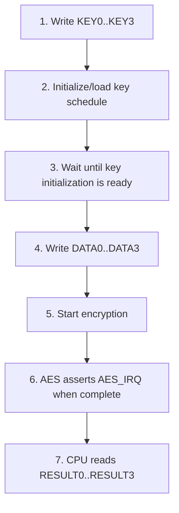

`STATUS.BUSY` and `STATUS.DONE` are software-visible.

## 10.6 CRC32/FCS --- `0x1000_5000`

| Offset | Register | R/W | Description |
|---|---|---|---|
| `0x00` | `CONTROL` | R/W | CRC control/reset |
| `0x04` | `STATUS` | R | Valid/pass/fail state |
| `0x08` | `DATA` | W | Software/testbench byte injection path if supported |
| `0x0C` | `RESULT` | R | CRC value and FCS status |

The normal SoC packet path supplies bytes directly to the CRC engine.
The software register path exists for initialization, diagnostics, and
block-level verification.

The wrapper must provide an unambiguous software-visible distinction
between:

```text
CRC result value
CRC/FCS valid
CRC/FCS pass
CRC/FCS fail
```

Exact bit allocation must be frozen before CRC driver coding.

---

<div align="right">Page 13</div>

[Back to Table of Contents](#table-of-contents)

# 11. AHB-Lite Bus Protocol Details

## 11.1 Protocol Model

The SoC uses synchronous AMBA AHB-Lite transactions.

A transfer contains:

1. Address/control phase.
2. Data/response phase.

`HTRANS` identifies the transfer type.

The primary project accesses are single-word register accesses, although
the VeeR bus interface is capable of the transaction behavior defined by
the selected AHB-Lite configuration.

## 11.2 Transfer Types

| `HTRANS` | Meaning |
|---|---|
| `2'b00` | IDLE |
| `2'b01` | BUSY |
| `2'b10` | NONSEQ |
| `2'b11` | SEQ |

For a normal isolated peripheral transaction, the first transfer uses
`NONSEQ`.

## 11.3 Write Transfer

```text
Address phase:
 HTRANS = NONSEQ
 HWRITE = 1
 HADDR = target address

Data phase:
 HWDATA = write data
```

The slave completes the transfer by asserting `HREADYOUT`.

## 11.4 Read Transfer

```text
Address phase:
 HTRANS = NONSEQ
 HWRITE = 0
 HADDR = target address

Data phase:
 HRDATA = read data
```

The slave completes the transfer by asserting `HREADYOUT`.

## 11.5 Wait States

If a slave cannot complete a transaction immediately:

```text
HREADYOUT = 0
```

The transfer remains active until the slave can complete it.

Simple register accesses should normally use zero wait states unless the
specific IP requires otherwise.

## 11.6 Response

```text
HRESP = 0 -> OKAY
HRESP = 1 -> ERROR
```

Unmapped accesses must not create an indeterminate bus response.

The interconnect routes unmapped accesses to a deterministic
default/error path and completes them with an `ERROR` response.

## 11.7 Address Decode

Exactly one slave is selected for a valid mapped address.

No address windows may overlap.

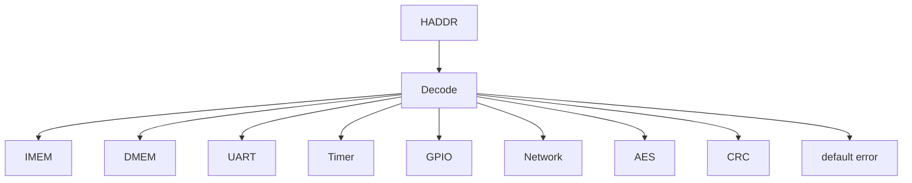

## 11.8 Arbitration

The baseline architecture uses a shared AHB-Lite fabric for the VeeR IFU
and LSU masters.

The current policy is:

```text
LSU priority > IFU priority
```

The reason is to keep data accesses, interrupt servicing, and peripheral
control responsive.

The arbitration logic must ensure that an active transfer remains owned
by its selected master until completion.

## 11.9 Read-Data Multiplexing

Only the selected slave may drive the logical response returned to the
active master.

The interconnect must not mix read data from unselected slaves.

## 11.10 Alignment

Defined software registers are accessed using 32-bit word-aligned
accesses.

The VeeR PRM states that accesses to its own PIC control/status
registers are word-sized and word-aligned. The SoC peripheral register
ABI follows the same discipline.

---

<div align="right">Page 14</div>

[Back to Table of Contents](#table-of-contents)

# 12. Interrupt Architecture

## 12.1 VeeR PIC

The architecture uses the VeeR programmable interrupt controller rather
than a simple external OR gate.

The VeeR PRM specifies a configurable PIC supporting external interrupt
sources with source IDs, priority levels, enable state, pending state,
thresholding, and vectored handling.

The SoC uses three external interrupt sources.

## 12.2 Source Assignment

```text
PIC Source ID 1 = Network Telemetry Engine
PIC Source ID 2 = AES-128
PIC Source ID 3 = Custom Timer
```

## 12.3 Network Interrupt

Condition:

```text
packet completion
AND
telemetry snapshot available
AND
network IRQ enabled
```

The interrupt informs the CPU that the software-visible telemetry state
is ready.

Software must clear the corresponding pending condition according to the
Network Telemetry register semantics and VeeR PIC requirements.

## 12.4 AES Interrupt

Condition:

```text
AES encryption complete
AND
AES IRQ enabled
```

The result registers become valid when the operation completes.

## 12.5 Timer Interrupt

Condition:

```text
COUNT reaches configured COMPARE
AND
timer enabled
AND
timer IRQ enabled
```

The custom Timer provides periodic timing functionality and a readable
count used by software for packet-event timestamping.

## 12.6 No UART Interrupt

UART interrupts are deliberately excluded.

The UART is a software-driven TX interface. Software checks `TX_BUSY`
before transmitting or uses a simple blocking driver.

---

<div align="right">Page 15</div>

[Back to Table of Contents](#table-of-contents)

# 13. Reset and Clock Architecture

## 13.1 Clock

The functional SoC uses one primary synchronous clock:

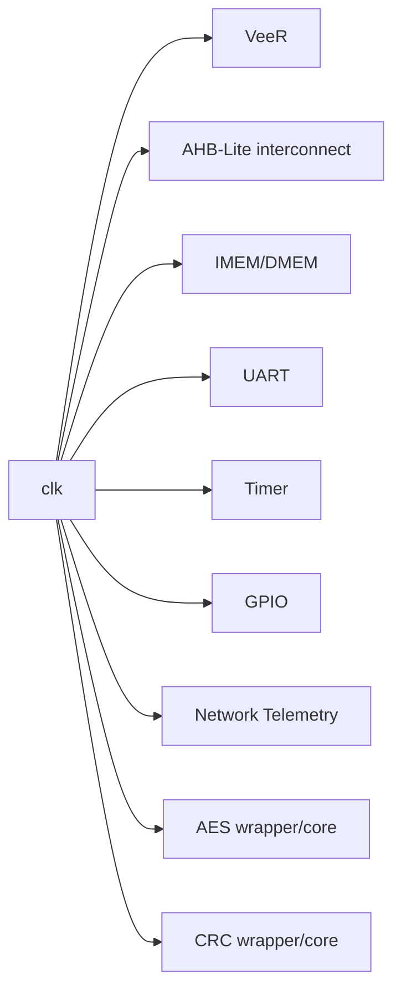

No functional multi-clock architecture is required.

The VeeR PRM states that the core complex has a single core clock and
that SoC-controlled clock enables can determine system-bus ratios. The
first project implementation should use a simple common-clock
arrangement unless the supplied wrapper requires otherwise.

## 13.2 Functional Reset

The SoC exposes an active-low functional reset:

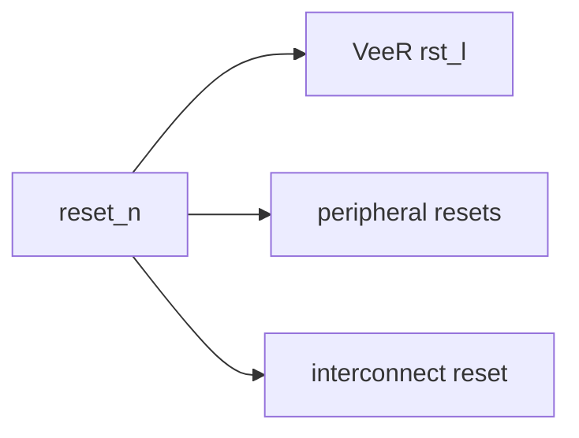

The exact VeeR reset connection must follow the supplied top-level
wrapper.

## 13.3 Debug Reset

The project is functional-SoC-only.

The VeeR Debug Module/JTAG infrastructure is not part of the external
project functionality. If the VeeR instance requires its debug
reset input, it must be held/configured according to the VeeR
integration requirements; it must not be treated as a user-visible SoC
feature.

## 13.4 Reset State

After reset:

- CPU starts from the configured VeeR reset vector.
- Peripheral enables are disabled.
- Pending peripheral interrupt status is cleared.
- Timer count returns to zero.
- Network counters return to zero.
- Network parser returns to `IDLE`.
- Telemetry snapshot is invalid.
- CRC state is initialized.
- AES `BUSY=0`.
- AES `DONE=0`.
- UART transmitter is idle.
- GPIO outputs return to defined reset values.

---

<div align="right">Page 16</div>

[Back to Table of Contents](#table-of-contents)

# 14. Timer and Timestamp Architecture

The project uses a **custom Timer** rather than relying on the VeeR
internal timer for the application-level packet timestamp.

## 14.1 Timer Function

The Timer provides:

1. Free-running 32-bit count.
2. Compare register.
3. Optional periodic auto-reload.
4. Timer interrupt.
5. Software-readable time base.

## 14.2 Timestamp Definition

The telemetry timestamp is explicitly defined as:

> **CPU-observed packet-event timestamp.**

It is not an exact physical ingress timestamp.

The sequence is:

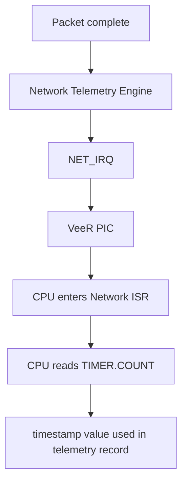

Therefore the timestamp includes interrupt-entry and
software-observation latency.

This definition must be used consistently in the RTL documentation,
software documentation, verification model, and final report.

---

<div align="right">Page 17</div>

[Back to Table of Contents](#table-of-contents)

# 15. AES-128 Architecture

## 15.1 Role

AES-128 protects the software-generated 128-bit telemetry record.

The processor does not perform AES rounds in software.

## 15.2 Interface Structure

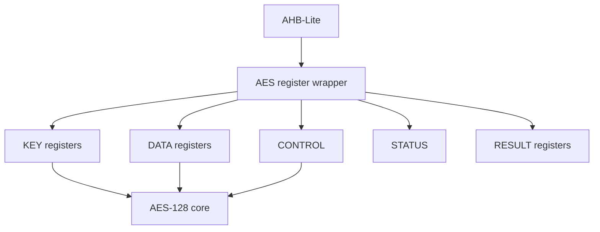

The selected open-source AES implementation is adapted behind the
project register wrapper.

## 15.3 Security Scope

The project implements:

- AES-128.
- One 128-bit plaintext telemetry block per encryption transaction.
- Software-controlled key loading.
- Software-controlled start.
- Hardware encryption.
- Interrupt-driven completion.
- Software-readable ciphertext.

The project does not implement AES-GCM, AES-256, SHA-256, key storage
hardware, secure boot, or a hardware key vault.

---

<div align="right">Page 18</div>

[Back to Table of Contents](#table-of-contents)

# 16. UART Architecture

The UART is custom-designed for this SoC.

## 16.1 Functional Role

UART is used to report:

- boot/status messages;
- packet statistics;
- CRC/FCS status;
- telemetry information;
- encrypted telemetry/ciphertext.

## 16.2 Current Interface

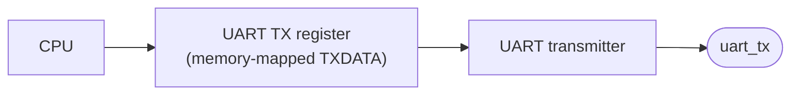

No UART interrupt is required.

## 16.3 TX Behavior

A software write to `TXDATA` loads the transmit byte when the
transmitter is available.

`STATUS.TX_BUSY` indicates an active transmission.

The driver may use blocking transmission:

```text
while (UART_STATUS & TX_BUSY)
 ;
UART_TXDATA = byte;
```

---

<div align="right">Page 19</div>

[Back to Table of Contents](#table-of-contents)

# 17. GPIO Architecture

GPIO is used as an externally visible hardware/software status
mechanism.

## 17.1 Outputs

```text
gpio[0] = CPU_ALIVE
gpio[1] = PKT_RX
gpio[2] = AES_BUSY
gpio[3] = PKT_ERR
```

The exact pulse/level duration for `PKT_RX` and software-controlled
`CPU_ALIVE` must be defined in the RTL/software interface before
verification sign-off.

The key architectural requirement is that these signals provide visible
status for simulation and optional future FPGA observation.

---

<div align="right">Page 20</div>

[Back to Table of Contents](#table-of-contents)

# 18. Software Architecture

## 18.1 Bare-Metal Application

The processor executes a bare-metal C application.

No Linux, RTOS, or TCP/IP stack is used.

## 18.2 Application Flow

```c
main()
{
 uart_init();
 timer_init();
 gpio_init();
 net_init();
 crc_init();
 aes_init();
 pic_init();

 enable_interrupts();
 print_banner();

 while (1) {
 wait_for_network_event();

 read_telemetry();
 read_crc_status();

 timestamp = timer_read();

 telemetry = build_128bit_record(
 telemetry_fields,
 timestamp,
 crc_status
 );

 aes_submit(telemetry);

 wait_for_aes_interrupt();

 ciphertext = aes_read_result();

 report_uart(ciphertext);
 }
}
```

The actual C implementation may use interrupt-driven state flags rather
than the pseudocode above, but the observable sequencing must remain
equivalent.

## 18.3 Software/Hardware Division

| Function | Hardware | Software |
|---|---|---|
| Ethernet byte reception | Yes | No |
| Ethernet field parsing | Yes | No |
| Packet counting | Yes | No |
| Byte counting | Yes | No |
| Error detection | Yes | No |
| CRC/FCS checking | Yes | No |
| Telemetry snapshot | Yes | No |
| Packet interrupt | Yes | Service |
| Timestamp observation | Timer hardware | **CPU reads Timer in ISR** |
| Telemetry record packing | No | Yes |
| AES rounds | Yes | No |
| AES job submission | No | Yes |
| Ciphertext retrieval | No | Yes |
| UART formatting | No | Yes |
| UART transmission | Hardware transmitter | Software writes TX register |

---

<div align="right">Page 21</div>

[Back to Table of Contents](#table-of-contents)

# 19. End-to-End Testbench Architecture

## 19.1 Verification Goal

The primary system-level proof is:

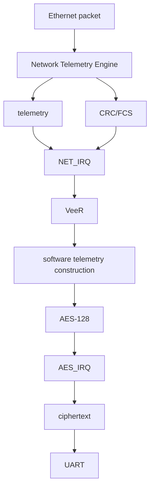

The testbench must prove the complete flow, not merely isolated register
behavior.

## 19.2 Testbench Components

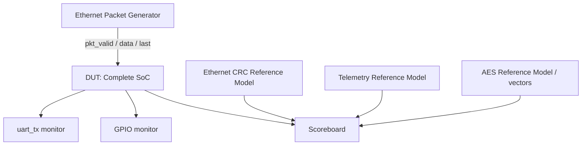

## 19.3 Scoreboard

The scoreboard compares:

1. Generated packet against DUT packet handling.
2. Expected frame length against telemetry length.
3. Expected Ethernet FCS against DUT CRC result.
4. Expected parser status against DUT status.
5. Expected counters against DUT counters.
6. Expected telemetry record against CPU/DUT-visible telemetry.
7. Expected AES ciphertext against the AES reference model.
8. Expected UART transaction sequence against the software result.

Waveform inspection is supplementary. The primary verification result
must be automated and self-checking.

## 19.4 Packet Classes

At minimum:

### Valid packets

- minimum-size Ethernet frame;
- normal Ethernet frame;
- maximum-size project frame;
- varied payload lengths;
- different destination/source MAC addresses;
- different EtherTypes;
- back-to-back packets.

### Invalid/malformed packets

- frame shorter than 64 bytes;
- frame longer than 1518 bytes;
- missing/incorrect `pkt_last`;
- FCS mismatch;
- unsupported EtherType;
- interrupted packet stream;
- illegal packet sequencing.

### Timing variation

- `pkt_valid` gaps;
- back-to-back valid bytes;
- different inter-packet gaps;
- reset during idle;
- reset between packets.

## 19.5 AES Verification

Use known AES-128 vectors and compare:

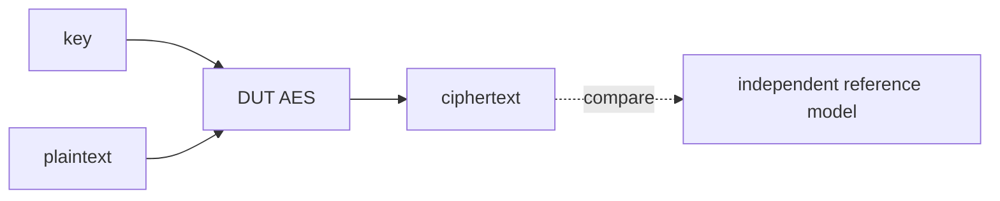

At least ten vectors are retained as the project verification target.

## 19.6 CRC Verification

CRC reference cases include:

- empty/reference data;
- known Ethernet CRC vectors;
- varied frame lengths;
- correct FCS;
- corrupted FCS;
- back-to-back frames;
- reset/reinitialization;
- byte gaps.

## 19.7 Bus Verification

Verify:

- read/write register accesses;
- reset values;
- aligned 32-bit accesses;
- unmapped accesses;
- HREADY wait states;
- HRESP error responses;
- master arbitration;
- IFU instruction fetch;
- LSU data access;
- correct slave select;
- correct read-data routing.

---

<div align="right">Page 22</div>

[Back to Table of Contents](#table-of-contents)

# 20. Verification Architecture

Verification is layered from IP level upward.

| Level | Scope | Primary Evidence |
|---|---|---|
| 1 | AES-128 | NIST/reference vectors, busy/done/result |
| 2 | CRC32/FCS | Reference model, correct/incorrect FCS, lengths |
| 3 | Network Telemetry | Ethernet parser, counters, length, errors, snapshot |
| 4 | AHB-Lite peripherals | Register access, reset, stalls, response |
| 5 | Interconnect | IFU/LSU routing, arbitration, read-data mux |
| 6 | VeeR software | Boot, initialization, interrupts, drivers |
| 7 | End-to-end SoC | Packet → telemetry → IRQ → CPU → AES → UART |

## 20.1 Completion Targets

- 100+ directed/randomized packet cases.
- 10+ AES-128 vectors.
- 10+ CRC/FCS cases.
- Full register-level read/write coverage.
- Interrupt assertion/clear/re-arm verification.
- At least one complete end-to-end waveform.
- Self-checking scoreboard.
- Software/reference model for CRC.
- Software/reference model for AES.
- Transaction-level telemetry reference model.

---

<div align="right">Page 23</div>

[Back to Table of Contents](#table-of-contents)

# 21. IP Integration and Provenance

## 21.1 VeeR EL2

**Source:** VeeR EL2 RTL.

The VeeR PRM describes:

- RV32IMC;
- four-stage scalar in-order pipeline;
- optional ICCM/DCCM;
- optional instruction cache;
- programmable interrupt controller;
- AHB-Lite or AXI4 system-bus configurations;
- separate instruction-fetch and load/store system-bus interfaces.

For this project the system architecture deliberately selects the
AHB-Lite configuration.

## 21.2 AES-128

**Source:** `secworks/aes`\
**License:** BSD-2-Clause\
**Role:** Adapted AES accelerator behind an AHB-Lite register wrapper.

The project interface exposes AES-128 only.

## 21.3 CRC32

**Source:** `alexforencich/verilog-lfsr` / related Ethernet usage
pattern\
**License:** MIT\
**Role:** Ethernet CRC-32/FCS checking on the packet stream.

The CRC core is adapted behind a project-specific control/status
wrapper.

## 21.4 VeeRwolf

The VeeRwolf reference SoC is retained as an integration-pattern
reference for VeeR plus standard peripherals. It is not a project
dependency and is not itself part of the final SoC.

---

<div align="right">Page 24</div>

[Back to Table of Contents](#table-of-contents)

# 22. Scope and Non-Goals

## 22.1 In Scope

- VeeR EL2 RV32IMC.
- AHB-Lite.
- IMEM.
- DMEM.
- Custom UART.
- Custom Timer.
- Custom GPIO.
- Custom Network Telemetry Engine.
- AES-128 accelerator.
- CRC32/FCS accelerator.
- VeeR PIC.
- Bare-metal C software.
- Ethernet packet testbench.
- End-to-end RTL simulation.
- Self-checking verification.

## 22.2 Out of Scope

- Ethernet PHY.
- GMII.
- RGMII.
- Physical MAC interface.
- Network clock-domain crossing.
- TCP/IP stack.
- ARP.
- DHCP.
- Linux.
- RTOS.
- DDR controller.
- AXI4 fabric.
- Multi-core operation.
- DMA-based packet movement.
- AES-GCM.
- SHA-256.
- Hardware key vault.
- Secure boot.
- Required FPGA bring-up.

IPv4/UDP parsing is a planned future extension and is not part of the
current Ethernet-only parser implementation.

---

<div align="right">Page 25</div>

[Back to Table of Contents](#table-of-contents)

# 23. Architectural Constraints

1. AHB-Lite is the selected system bus.
2. VeeR bus data width follows the actual supplied VeeR AHB interface.
3. Peripheral registers use a 32-bit software ABI.
4. Packet input is an 8-bit synchronous stream.
5. Packet input has no ready/valid backpressure beyond `pkt_valid`.
6. Ethernet FCS is supplied by the testbench.
7. CRC/FCS checking is concurrent with packet parsing.
8. CRC does not sit in series with the parser.
9. One telemetry snapshot is retained.
10. Snapshot overflow is visible and deterministic.
11. CRC failure is distinct from structural parser error.
12. Unsupported EtherTypes do not automatically imply CRC failure.
13. AES is AES-128 only.
14. AES completion uses an interrupt.
15. UART does not generate interrupts.
16. Network, AES, and Timer use independent VeeR PIC source IDs.
17. Timestamp means CPU-observed packet-event timestamp.
18. Current packet format is Ethernet II.
19. IPv4 fields remain reserved/zero until the IPv4 extension.
20. No physical network interface is required for functional proof.

---

<div align="right">Page 26</div>

[Back to Table of Contents](#table-of-contents)

# 24. Implementation Phases and Definition of Done

| Phase | Deliverable | Exit Criterion |
|---|---|---|
| 0 | VeeR bring-up | Supplied configuration confirmed and CPU executes a basic program |
| 1 | SoC infrastructure | AHB-Lite fabric, memories, reset/clock, decode verified |
| 2 | Mandatory peripherals | UART, Timer, GPIO software-accessible |
| 3 | Network Telemetry | Ethernet stream produces correct telemetry/counters/IRQ |
| 4 | CRC32/FCS | Correct Ethernet integrity result |
| 5 | AES-128 | CPU submits telemetry and reads correct ciphertext |
| 6 | Software | Complete bare-metal application runs |
| 7 | End-to-end verification | Packet, interrupt, telemetry, AES, UART flow proven |
| 8 | Optional synthesis/FPGA | Only after simulation proof is stable |

## Minimum Viable Checkpoint

The original project plan identifies Phases 0--4 as the minimum
defensible working checkpoint:


AES integration remains a later phase so that the core SoC can be
demonstrated before final cryptographic integration.

---

<div align="right">Page 27</div>

[Back to Table of Contents](#table-of-contents)

# 25. Design-Critical Register/Interface Freeze List

Before RTL implementation is declared frozen, the following must be
checked into the project source tree:

- [ ] VeeR exact build/configuration.
- [ ] VeeR reset vector.
- [ ] ICCM/DCCM presence and sizes.
- [ ] VeeR PIC configuration.
- [ ] VeeR AHB-Lite top-level port widths.
- [ ] Final memory map.
- [ ] Final register offsets.
- [ ] Exact register reset values.
- [ ] Exact Network `STATUS` bit allocation.
- [ ] Exact Network `IRQ_STATUS` bit allocation.
- [ ] Exact CRC `STATUS` bit allocation.
- [ ] Exact CRC `RESULT` bit allocation.
- [ ] Exact AES `CONTROL`/`STATUS` bit allocation.
- [ ] Exact UART status/control bit allocation.
- [ ] Exact Timer control/status bit allocation.
- [ ] Exact GPIO behavior.
- [ ] Exact 128-bit telemetry word packing.
- [ ] Ethernet parser FSM state behavior.
- [ ] Ethernet FCS byte ordering.
- [ ] Packet overflow semantics.
- [ ] Interrupt clear semantics.
- [ ] Reset behavior.
- [ ] Testbench packet timing rules.

---

<div align="right">Page 28</div>

[Back to Table of Contents](#table-of-contents)

# 26. Risks and Open Items

| Item | Status | Required Action |
|---|---|---|
| VeeR AHB configuration | Architecture selected | Confirm exact supplied build |
| VeeR ICCM/DCCM | RTL-config dependent | Extract actual parameters before memory-map RTL freeze |
| VeeR reset vector | RTL-config dependent | Confirm from supplied configuration |
| PIC source configuration | Architecture selected | Confirm exact instantiated source/gateway configuration |
| 128-bit telemetry packing | Architecture selected | Freeze exact software bit allocation before driver/AES integration |
| CRC result bit allocation | Controlled | Freeze wrapper RTL definition |
| Network status bit allocation | Controlled | Freeze wrapper RTL definition |
| UART implementation | Custom | RTL design required |
| Timer implementation | Custom | RTL design required |
| GPIO implementation | Custom | RTL design required |
| Ethernet parser | Custom | RTL design required |
| IPv4 parsing | Future | Do not implement in current phase |
| Physical Ethernet | Out of scope | Direct testbench injection |
| Debug/JTAG | Functional SoC only | Do not expose as project functionality |
| DMA | Out of scope | No initial DMA architecture |

---

<div align="right">Page 29</div>

[Back to Table of Contents](#table-of-contents)

# 27. Architecture-to-RTL Mapping

The architecture should translate into the following logical RTL
hierarchy:

```mermaid
flowchart TD
    TOP["soc_top"] --> VEER["veer_el2"]
    TOP --> AHB["ahb_interconnect"]
    AHB --> IMEM["imem"]
    AHB --> DMEM["dmem"]
    AHB --> UART["uart"]
    AHB --> TIMER["timer"]
    AHB --> GPIO["gpio"]
    AHB --> NET["network_telemetry"]
    AHB --> AESW["aes128_wrapper"]
    AHB --> CRCW["crc32_wrapper"]
    TOP --> PICCONN["pic_interrupt_connections"]
    TOP --> FANOUT["packet_stream_fanout"]
    FANOUT --> NET2["network_telemetry"]
    FANOUT --> CRC2["crc32_fcs"]
    TOP --> RSTCTRL["reset_control"]
    TOP --> CLOCK["clock"]
```

The exact VeeR wrapper hierarchy must follow the supplied RTL.

---

<div align="right">Page 30</div>

[Back to Table of Contents](#table-of-contents)

# 28. Architecture-to-Software Mapping

Suggested source organization:

```text
software/
|
+-- startup.S
+-- linker.ld
+-- main.c
|
+-- uart.c
+-- uart.h
|
+-- timer.c
+-- timer.h
|
+-- gpio.c
+-- gpio.h
|
+-- network.c
+-- network.h
|
+-- crc.c
+-- crc.h
|
+-- aes.c
+-- aes.h
|
+-- interrupts.c
+-- interrupts.h
```

Driver responsibilities:

| Driver | Responsibility |
|---|---|
| `uart` | TX initialization and byte/string output |
| `timer` | Counter/compare configuration and reads |
| `gpio` | Status output |
| `network` | Enable, status, telemetry reads, IRQ clear |
| `crc` | Status/result access and control |
| `aes` | Key/data load, start, IRQ completion, result read |
| `interrupts` | PIC configuration and ISR dispatch |

---

<div align="right">Page 31</div>

[Back to Table of Contents](#table-of-contents)

# 29. End-to-End Functional Contract

A passing end-to-end execution must demonstrate all of the following in
one coherent scenario:

```text
1. SoC reset
2. VeeR boots
3. Software initializes peripherals
4. PIC interrupt sources are configured
5. Network Telemetry Engine is enabled
6. CRC path is initialized
7. Testbench generates an Ethernet II frame
8. pkt_valid/pkt_data/pkt_last deliver the frame
9. Telemetry Engine parses the frame
10. CRC checks the received FCS
11. Packet counters update
12. Telemetry snapshot becomes ready
13. NET_IRQ reaches VeeR PIC
14. CPU services the Network interrupt
15. CPU reads telemetry registers
16. CPU reads CRC/FCS status
17. CPU reads Timer COUNT
18. Software records the CPU-observed packet-event timestamp
19. Software constructs the 128-bit telemetry record
20. Software writes AES key/plaintext
21. AES encryption starts
22. AES completes
23. AES_IRQ reaches VeeR PIC
24. CPU reads ciphertext
25. Software formats the result
26. UART transmits the result
27. Testbench scoreboard verifies expected telemetry, CRC, AES result, and UART behavior
```

Failure at any stage is a system-level verification failure.

---

<div align="right">Page 32</div>

[Back to Table of Contents](#table-of-contents)

# 30. Final Architecture Summary

The final SoC is a VeeR EL2 RV32IMC-based AHB-Lite system with:

```mermaid
flowchart TD
    VEER["VeeR EL2 RV32<br/>(CONTROL PLANE)"] -- "AHB-Lite" --> MEM["Memory<br/>IMEM/DMEM"]
    VEER -- "AHB-Lite" --> PERIPH["Peripherals<br/>UART/Timer/GPIO"]
    VEER -- "AHB-Lite" --> ACC["Accelerators<br/>Network/AES/CRC"]

    PKT["Ethernet packet stream<br/>(DATA PLANE)"] --> TEL["Telemetry"]
    PKT --> CRCD["CRC/FCS"]
    TEL --> NIRQ["NET interrupt"]
    NIRQ --> VEER2["VeeR"]
    VEER2 --> T128["128-bit telemetry"]
    T128 --> AES128["AES-128"]
    AES128 --> CT["ciphertext"]
    CT --> UARTOUT["UART"]
```

The architecture therefore implements the intended hardware/software
division:

**Hardware handles repetitive packet processing, integrity checking,
counting, status capture, and cryptographic computation. Software
handles system configuration, interrupt handling, telemetry assembly,
accelerator control, and reporting.**

This document is the baseline from which the RTL hierarchy, register
definitions, software drivers, and end-to-end verification environment
are to be implemented. VeeR-specific configuration values that are not
safely derivable from the supplied build remain explicitly
configuration-dependent and must be resolved from the actual RTL before
the corresponding memory/interconnect implementation is frozen.

---

<div align="right">Page 33</div>

[Back to Table of Contents](#table-of-contents)

# 31. Source Basis

This architecture baseline was reconstructed from the project source
set:

1. `RISC_V_Network_Telemetry_Project_Abstract.docx`
2. `PRD_RISCV_Network_Telemetry_SoC.md`
3. `RISC_V_Network_Telemetry_Architecture_Document.docx`
4. `RISC_V_Network_Telemetry_Block_Diagram.docx`
5. `RISC_V_Network_Telemetry_SoC_Port_List.md`
6. `RISC-V_VeeR_EL2_PRM.pdf`
7. Supplied `chipsalliance/Cores-VeeR-EL2` RTL/source snapshot.

The project documents establish the intended SoC structure, application
flow, IP selection, memory-map baseline, verification strategy, and
implementation phases. The VeeR PRM and supplied RTL are authoritative
for VeeR-specific bus, interrupt, reset, memory, and configuration
behavior.

The architecture decisions recorded during project review supersede
earlier unresolved alternatives:

- AHB-Lite is selected.
- VeeR PIC is selected.
- PIC source IDs are 1 = Network, 2 = AES, 3 = Timer.
- Ethernet FCS is included.
- CRC operates concurrently with packet parsing.
- Ethernet II is the current packet format.
- IPv4 is a future extension.
- The telemetry record remains IP-oriented.
- The timestamp is explicitly CPU-observed.
- AES is AES-128 only.
- AES completion is interrupt-driven.
- UART is TX-only with no UART interrupt.
- The end-to-end SoC testbench is the final system-level proof.
